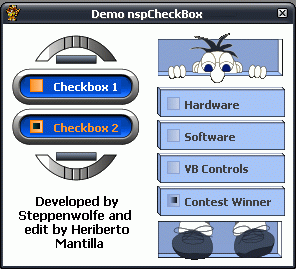



## nspCheckBox 1\.0

### Description

Small, attractiveness and faster draw checkbox programmed by Steppenwolfe and modified a little by my.

Comments is wellcome, votes I prefer that not.

NOTE: The intellectual author of the code authorizes myself to make it public.
 
### More Info
 

             |
---                |---
**Submitted On**   |2006-07-12 11:03:06
**By**             |[Heriberto Mantilla Santamaria](https://github.com/Planet-Source-Code/PSCIndex/blob/master/ByAuthor/heriberto-mantilla-santamaria.md)
**Level**          |Intermediate
**User Rating**    |5.0 (15 globes from 3 users)
**Compatibility**  |VB 5\.0, VB 6\.0
**Category**       |[Custom Controls/ Forms/  Menus](https://github.com/Planet-Source-Code/PSCIndex/blob/master/ByCategory/custom-controls-forms-menus__1-4.md)
**World**          |[Visual Basic](https://github.com/Planet-Source-Code/PSCIndex/blob/master/ByWorld/visual-basic.md)
**Archive File**   |[nspCheckBo2005927122006\.zip](https://github.com/Planet-Source-Code/heriberto-mantilla-santamaria-nspcheckbox-1-0__1-65898/archive/master.zip)

